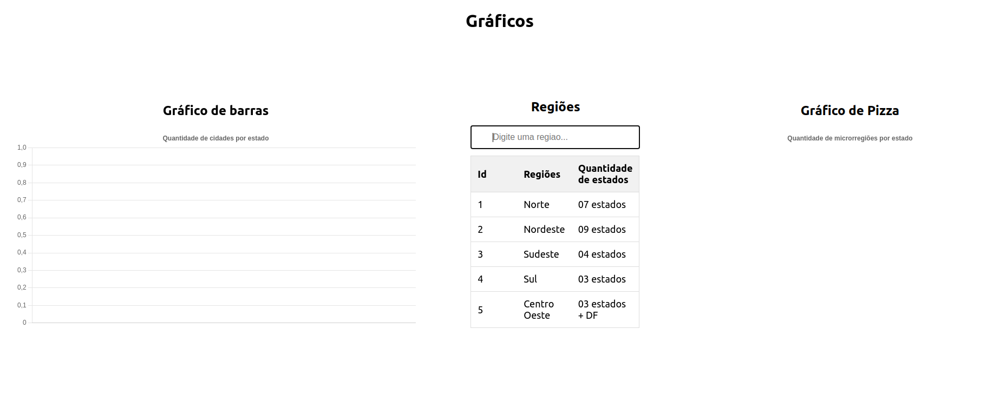
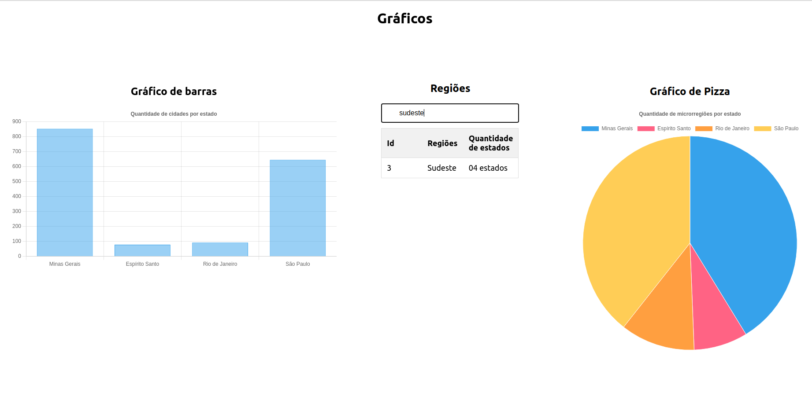

# Primeiros passos 

Após clonar o projeto execute: ( `npm install .` )
Para instalar as dependências do projeto Node.js a partir do diretório atual. 
O npm procura pelo arquivo package.json no diretório atual e instala as dependências listadas neste arquivo.

## Scripts Disponíveis

No diretório do projeto, você pode executar:

### `npm start`

Executa o aplicativo no modo de desenvolvimento.\
Abra (http://localhost:3000)

### Gráficos

